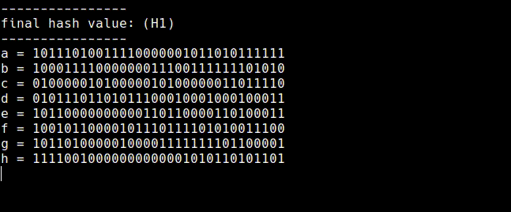

# SHA



Python implementation of SHA-1, SHA-2, and SHA-3 Cryptographic Hash Algorithms.

* **[SHA-1:](https://github.com/alvxck/SHA/blob/master/hashs/sha1.py)** [ SHA-1 ]

* **[SHA-2:](https://github.com/alvxck/SHA/blob/master/hashs/sha2.py)** [ SHA-224, SHA-256, SHA-384, SHA-512, SHA-512/224, SHA-512/256 ]

* **[SHA-3:](https://github.com/alvxck/SHA/blob/master/hashs/sha3.py)** [ SHA3-224, SHA3-256, SHA3-384, SHA3-512, SHAKE128, SHAKE256 ]


The goal of this project is to create reference implementations of the SHA-1, SHA-2, and SHA-3 Cryptographic Hash Algorithms in order to explore and simplify the hashing processes within each. This project capitalizes on python's simple syntax and interpretability to give a human-like breakdown of the stages within each algorithm. This project is not optimised for performance and is created for the sole purpose of understanding how SHA-1, SHA-2, and SHA-3 operate.  

<!-- SHA1 -->
## SHA-1 Hash Algorithm
Implementation in accordance with NIST **[FIPS PUB 180-4](https://nvlpubs.nist.gov/nistpubs/FIPS/NIST.FIPS.180-4.pdf)** standard.

### [sha1.py](https://github.com/alvxck/SHA/blob/master/hashs/sha1.py)
```
sha1('hello world')
> '2aae6c35c94fcfb415dbe95f408b9ce91ee846ed'
```

### Hashing Process

1. Pre Process
    * Convert each character from `message` to 8-bits and append to `data`. Then append a single *1*.
    * Pad `data` with *0's* until it is a multiple of 512-bits.
    * Use the last 64-bits of `data` to represent the length of `message`.

2. Chunk Loop
    * Break `data` into 32-bit sections and save all sections to `blocks`.
    * Append 64 *0's* to `blocks`.

3. Compression Loop
    * Modify the *0's* added in step 2 following SHA-1 hash computation procedures. **[[6.1.0]](https://nvlpubs.nist.gov/nistpubs/FIPS/NIST.FIPS.180-4.pdf#page=23)**.

4. Mutation Loop
    * Initialize all 8 `hash_constants` to a b c d e respectively.
    * Modify a-e using the values in `blocks` and values in `round_constants` following SHA-1 hash computation procedures. **[[6.1.0]](https://nvlpubs.nist.gov/nistpubs/FIPS/NIST.FIPS.180-4.pdf#page=23)**.
    * Repeat previous step once for each value in `round_constants`.  
    (x80 iterations)

6. Concatenation
    * Concatenate newly modified values in `hash_constants` to create digest.
    * Return digest to user.

<!-- SHA2 -->
## SHA-2 Hash Algorithms

Implementations in accordance with NIST **[FIPS PUB 180-4](https://nvlpubs.nist.gov/nistpubs/FIPS/NIST.FIPS.180-4.pdf)** standard.

### [sha2.py](https://github.com/alvxck/SHA/blob/master/hashs/sha2.py)
```
sha224('hello world') 
> '2f05477fc24bb4faefd86517156dafdecec45b8ad3cf2522a563582b'

sha256('hello world')
> 'b94d27b9934d3e08a52e52d7da7dabfac484efe37a5380ee9088f7ace2efcde9'

sha384('hello world')
> 'fdbd8e75a67f29f701a4e040385e2e23986303ea10239211af907fcbb83578b3e417cb71ce646efd0819dd8c088de1bd'

sha512('hello world')
> '309ecc489c12d6eb4cc40f50c902f2b4d0ed77ee511a7c7a9bcd3ca86d4cd86f989dd35bc5ff499670da34255b45b0cfd830e81f605dcf7dc5542e93ae9cd76f'

sha512_224('hello world')
> '22e0d52336f64a998085078b05a6e37b26f8120f43bf4db4c43a64ee'

sha512_256('hello world')
> '0ac561fac838104e3f2e4ad107b4bee3e938bf15f2b15f009ccccd61a913f017'
```

### Hashing Process
* 32-bit [ SHA-224, SHA-256 ] 
* 64-bit [ SHA-384, SHA-512, SHA-512/224, SHA-512/256 ]

1. Pre Process
    * Convert each character from `message` to 8-bits and append to `data`. Then append a single *1*.
    * Pad `data` with *0's* until it is a multiple of 512-bits (32-bit) or a multiple of 1024-bits (64-bit).
    * Use the last 64-bits (32-bit) or 128-bits (64-bit) of `data` to represent the length of `message`.

2. Chunk Loop
    * Break `data` into 32-bit (32-bit) or 64-bit (64-bit) sections and save all sections to `blocks`.
    * Append 48 *0's* (32-bit) or 80 *0's* (64-bit) to `blocks`.

3. Compression Loop
    * Modify the *0's* added in step 2 following SHA-2 hash computation procedures.  
    (32-bit **[[6.2.2]](https://nvlpubs.nist.gov/nistpubs/FIPS/NIST.FIPS.180-4.pdf#page=27)**. 64-bit **[[6.4.2]](https://nvlpubs.nist.gov/nistpubs/FIPS/NIST.FIPS.180-4.pdf#page=29)**)

4. Mutation Loop
    * Initialize all 8 `hash_constants` to a b c d e f g h respectively.
    * Modify a-h using the values in `blocks` and values in `round_constants` following SHA-2 hash computation procedures.  
    (32-bit **[[6.2.2]](https://nvlpubs.nist.gov/nistpubs/FIPS/NIST.FIPS.180-4.pdf#page=27)**. 64-bit **[[6.4.2]](https://nvlpubs.nist.gov/nistpubs/FIPS/NIST.FIPS.180-4.pdf#page=29)**)
    * Repeat previous step once for each value in `round_constants`.  
    (32-bit: x64 iterations | 64-bit: x80 iterations)

6. Concatenation
    * Concatenate newly modified values in `hash_constants` to create digest.
    * Return digest to user.

<!-- SHA3 -->
## SHA-3 Hash Algorithms

Implementations in accordance with NIST **[FIPS PUB 202](https://nvlpubs.nist.gov/nistpubs/FIPS/NIST.FIPS.202.pdf)** standard.

### [sha3.py](https://github.com/alvxck/SHA/blob/master/hashs/sha3.py)
```
sha3_224('hello world')
> 'dfb7f18c77e928bb56faeb2da27291bd790bc1045cde45f3210bb6c5'

sha3_256('hello world')
> '644bcc7e564373040999aac89e7622f3ca71fba1d972fd94a31c3bfbf24e3938'

sha3_384('hello world')
> '83bff28dde1b1bf5810071c6643c08e5b05bdb836effd70b403ea8ea0a634dc4997eb1053aa3593f590f9c63630dd90b'

sha3_512('hello world')
> '840006653e9ac9e95117a15c915caab81662918e925de9e004f774ff82d7079a40d4d27b1b372657c61d46d470304c88c788b3a4527ad074d1dccbee5dbaa99a'

shake128('hello world', 128)
> '3a9159f071e4dd1c8c4f968607c30942'

shake256('hello world', 256)
> '369771bb2cb9d2b04c1d54cca487e372d9f187f73f7ba3f65b95c8ee7798c527'
```

### Hashing Process

1. State Array Construction **[[3.1.2]](https://nvlpubs.nist.gov/nistpubs/FIPS/NIST.FIPS.202.pdf#page=17)**
    * Convert a string `S` of 1600-bits to a 5 x 5 x 64 array `A` where `A`[x, y, z] = `S`[w(5y+x)+z].

2. Keccak-P Permutations **[[3.2.0]](https://nvlpubs.nist.gov/nistpubs/FIPS/NIST.FIPS.202.pdf#page=19)**
    * Given a state array `A` and a round index `r`, the round function `Rnd` is the transformation that results from applying the step mappings `θ`, `ρ`, `π`, `χ`, and `ι` to `A`. [ `Rnd(A, r) = ι(χ(π(ρ(θ(A)))), r)` ] 
    * θ : XOR each bit of the state array with 2 columns.
    * ρ : Rotate the bits in each lane by a specified offset. 
    * π : Shuffle lanes.
    * χ : XOR each bit of the state array with a non-linear function of bits from the same row.
    * ι : Only modify certain bits of a lane based on a round index.

3. Sponge **[[4.0.0]](https://nvlpubs.nist.gov/nistpubs/FIPS/NIST.FIPS.202.pdf#page=26)**
    * Convert `message` to binary and pad `message` using `pad10*1`.
    * Create a state array from `message` and perform the 5 Keccak-p permutations.
    * Convert the modified state array back to a string `S`.
    * Truncate `S` to the desired length. (224-bit, 256-bit, 384-bit, 512-bit) 
